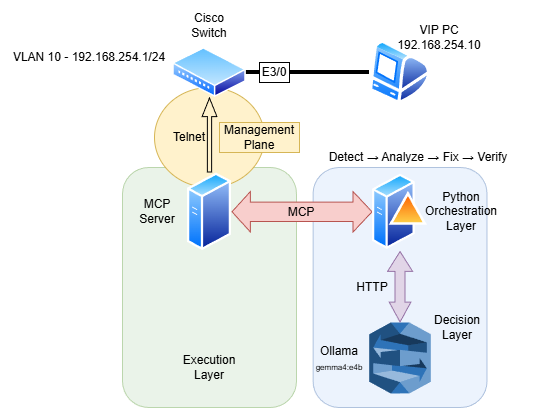

# 🚀 AI Network Agent (Local, Autonomous, Context-Aware)

> **Part 1** of an ongoing series exploring agentic AI for network operations. More approaches coming soon.

A local, agentic AI that monitors network infrastructure, understands context, and autonomously remediates issues—without overreacting to normal user behavior.

---

## 🎯 Why This Exists

Traditional network automation often fails because it:
*   **Reacts blindly** to events.
*   **Applies static rules** that don't account for environment changes.
*   **Cannot distinguish** between intentional administrative changes and genuine anomalies.

**This project demonstrates closed-loop, context-aware remediation using AI + [MCP (Model Context Protocol)](https://modelcontextprotocol.io/).**

---

## 🧠 Key Insight

> The intelligence is not just the LLM; it is the **context** you provide to it.

The agent makes decisions based on:
*   Real-time interface states.
*   Endpoint presence and reachability.
*   Current interface and device configuration.
*   Confidence scoring before making changes.

---

## 🧠 What Makes This Different?

This is **NOT**:
*   ❌ A simple script running `show` commands.
*   ❌ A basic chatbot for networking queries.

This **IS**:
*   🧠 **Context-aware reasoning**: Evaluates state before acting.
*   🔁 **Closed-loop automation**: Detects, analyzes, fixes, and verifies.
*   🛠️ **Tool-based architecture**: Uses MCP to bridge the gap between LLMs and CLI.
*   🎯 **Confidence scoring**: Rates its own certainty before making config changes.
*   🏠 **100% Local**: Privacy-focused, running entirely on your hardware.

---

## 🏗️ Architecture



The system utilizes an MCP server to provide the LLM with specific "tools" (via Netmiko) to interact with Cisco switches, while Ollama handles the reasoning logic locally.

---

## 🔄 How It Works

Each monitoring cycle follows this flow:

1. **Detect** — Ping the VIP endpoint to check reachability.
2. **Analyze** — If unreachable, inspect interface state and configuration.
3. **Reason** — LLM evaluates context and assigns a confidence score.
4. **Fix** — Apply corrective action (no shutdown, VLAN fix, etc.) if confidence is high.
5. **Verify** — Re-check endpoint reachability to confirm the fix worked.

---

## 🧪 Demo Scenarios

### ✅ 1. Admin Mistake (Auto-Heal)
**Scenario:** An administrator accidentally shuts down a critical trunk interface.

```bash
interface e3/0
  shutdown
```

**Agent Action:**
1.  **Detects** the `admin down` state.
2.  **Analyzes** the interface's importance based on connected neighbors.
3.  **Executes** `no shutdown`.
4.  **Verifies** the link is back up.

### ✅ 2. Misconfiguration (Auto-Fix)
**Scenario:** An endpoint is moved to a port with the wrong VLAN assigned, breaking connectivity.

**Agent Action:**
1.  **Detects** a connectivity issue.
2.  **Applies** the correct VLAN configuration.
3.  **Confirms** end-to-end reachability.

---

## 🧰 Tech Stack

| Component              | Technology                                    |
|:-----------------------|:----------------------------------------------|
| **MCP Server**         | [FastMCP](https://github.com/jlowin/fastmcp)  |
| **Network Automation** | [Netmiko](https://github.com/ktbyers/netmiko) |
| **Local AI Engine**    | [Ollama](https://ollama.com/)                 |
| **Local LLM**          | [Gemma4 (E4B)](https://deepmind.google/models/gemma/gemma-4/#e2b-and-e4b) |
| **Lab Environment**    | GNS3 (Cisco IOS image)          |

---

## 📋 Prerequisites

- **Python** 3.10+
- **Ollama** installed and running locally ([install guide](https://ollama.com/download))
- **Gemma4 model** pulled: `ollama pull gemma4:e4b`
- **GNS3** with a Cisco IOS switch image configured and reachable via telnet
- **Git** (to clone the repo)

---

## 🚀 Getting Started

1.  **Clone the repo:**
    ```bash
    git clone https://github.com/<your-username>/networkagent.git
    cd networkagent
    ```

2.  **Install dependencies:**
    ```bash
    pip install -r requirements.txt
    ```

3.  **Configure device connection** in `mcp_server/mcp_server.py`:
    Update the `DEVICE` dict with your GNS3 switch's IP, port, and credentials.

4.  **Start the MCP Server:**
    ```bash
    python mcp_server/mcp_server.py
    ```

5.  **Run the Agent:**
    ```bash
    python agent/network_agent_1P.py
    ```

6.  **Simulate Failures:**
    *   Shut down a critical interface.
    *   Change a production VLAN.
    *   Apply an ACL to deny traffic.
    *   Pause a connection on GNS3.

---

## 🔒 Local-First Design

*   No cloud APIs.
*   No external telemetry.
*   Fully self-contained.
*   **Suitable for enterprise environments with strict data privacy policies.**

---

## ⚠️ Limitations & Known Issues

- Single device only — monitors one Cisco IOS switch at a time.
- No rollback if a remediation action makes things worse.
- Depends on specific IOS command output parsing (may break on different IOS versions).
- LLM can occasionally produce malformed JSON, which the agent handles gracefully but skips the cycle.
- Telnet-based connection (no SSH in current GNS3 lab setup).

---

## 📌 Future Improvements

- [ ] VLAN misconfiguration detection.
- [ ] Interface flapping detection and dampening.
- [ ] Long-term memory (event history database).
- [ ] Multi-vendor / multi-device support.
- [ ] Rollback mechanism for failed remediations.
- [ ] Terminal recording / demo GIF for the README.

### 🗺️ Series Roadmap
| Part | Approach | Status |
|:-----|:---------|:-------|
| **1** | MCP + Ollama (this repo) | ✅ Done |
| **2** | TBD | 🔜 Coming soon |
| **3** | TBD | 🔜 Coming soon |

---

## 🤝 Contributing

PRs are welcome!

⭐ **If this was useful, give it a star — it helps others discover the project!**
